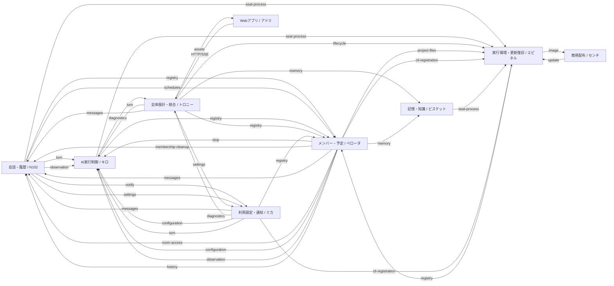
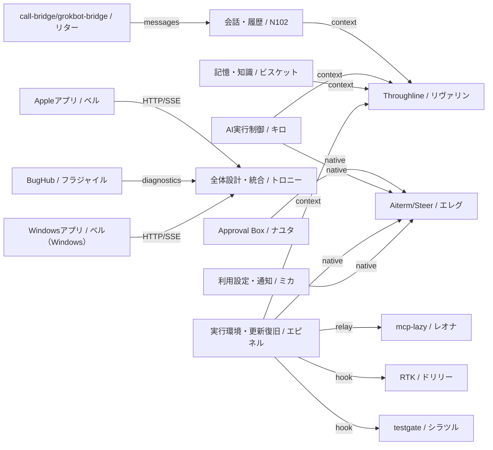

# BellTeamの全体機能図

<!-- Generated by scripts/render-feature-map.mjs. Edit modules/*/module.json instead. -->

各機能の接続情報から生成する。個別の内部図と公開契約は下表の正本を参照。[担当と変更手順](module-ownership.md)。

担当は設定済み。コード・詳細図の単独更新に向けた分離は各担当が実施中で、完了を意味しない。接続線は公開窓口への依存を示し、全てが直接の関数呼出しという意味ではない。

## 本体の接続

```mermaid
flowchart LR
  m_conversation["会話・履歴 / N102"]
  m_distribution["商用配布 / センチ"]
  m_execution["AI実行制御 / キロ"]
  m_integration["全体設計・統合 / トロニー"]
  m_members["メンバー・予定 / ベロータ"]
  m_memory["記憶・知識 / ビスケット"]
  m_runtime["実行環境・更新復旧 / エピネル"]
  m_usage["利用設定・通知 / ミカ"]
  m_web["Webアプリ / アドミ"]
  m_conversation -->|"turn"| m_execution
  m_conversation -->|"registry"| m_members
  m_conversation -->|"notify"| m_usage
  m_conversation -->|"schedules"| m_members
  m_conversation -->|"seat-process"| m_runtime
  m_conversation -->|"settings"| m_usage
  m_conversation -->|"observation"| m_execution
  m_distribution -->|"update"| m_runtime
  m_execution -->|"diagnostics"| m_integration
  m_execution -->|"registry"| m_members
  m_execution -->|"seat-process"| m_runtime
  m_integration -->|"turn"| m_execution
  m_integration -->|"messages"| m_conversation
  m_integration -->|"registry"| m_members
  m_integration -->|"settings"| m_usage
  m_integration -->|"memory"| m_memory
  m_integration -->|"lifecycle"| m_runtime
  m_integration -->|"assets"| m_web
  m_members -->|"stop"| m_execution
  m_members -->|"project-files"| m_runtime
  m_members -->|"cli-registration"| m_runtime
  m_members -->|"membership-cleanup"| m_conversation
  m_members -->|"messages"| m_conversation
  m_members -->|"memory"| m_memory
  m_members -->|"room-access"| m_conversation
  m_members -->|"configuration"| m_execution
  m_members -->|"observation"| m_execution
  m_members -->|"history"| m_conversation
  m_memory -->|"seat-process"| m_runtime
  m_runtime -->|"registry"| m_members
  m_runtime -->|"image"| m_distribution
  m_usage -->|"registry"| m_members
  m_usage -->|"messages"| m_conversation
  m_usage -->|"cli-registration"| m_runtime
  m_usage -->|"diagnostics"| m_integration
  m_usage -->|"configuration"| m_execution
  m_usage -->|"turn"| m_execution
  m_web -->|"HTTP/SSE"| m_integration
```

## アプリ・独立製品との接続

```mermaid
flowchart LR
  m_aiterm["Aiterm/Steer / エレグ"]
  m_apple["Appleアプリ / ベル"]
  m_approval_box["Approval Box / ナユタ"]
  m_bridge["call-bridge/grokbot-bridge / リター"]
  m_bughub["BugHub / フラジャイル"]
  m_conversation["会話・履歴 / N102"]
  m_execution["AI実行制御 / キロ"]
  m_integration["全体設計・統合 / トロニー"]
  m_mcp_lazy["mcp-lazy / レオナ"]
  m_memory["記憶・知識 / ビスケット"]
  m_rtk["RTK / ドリリー"]
  m_runtime["実行環境・更新復旧 / エピネル"]
  m_testgate["testgate / シラツル"]
  m_throughline["Throughline / リヴァリン"]
  m_usage["利用設定・通知 / ミカ"]
  m_windows["Windowsアプリ / ベル（Windows）"]
  m_apple -->|"HTTP/SSE"| m_integration
  m_approval_box -->|"native"| m_aiterm
  m_bridge -->|"messages"| m_conversation
  m_bughub -->|"diagnostics"| m_integration
  m_conversation -->|"context"| m_throughline
  m_execution -->|"native"| m_aiterm
  m_execution -->|"context"| m_throughline
  m_memory -->|"context"| m_throughline
  m_runtime -->|"native"| m_aiterm
  m_runtime -->|"context"| m_throughline
  m_runtime -->|"relay"| m_mcp_lazy
  m_runtime -->|"hook"| m_rtk
  m_runtime -->|"hook"| m_testgate
  m_usage -->|"native"| m_aiterm
  m_windows -->|"HTTP/SSE"| m_integration
```

## 担当図と公開窓口

| 機能の正本 | 担当 | 公開窓口 |
| --- | --- | --- |
| [Aiterm/Steer](modules/aiterm/README.md) | エレグ | native |
| [Appleアプリ](modules/apple/README.md) | ベル |  |
| [Approval Box](modules/approval-box/README.md) | ナユタ | public |
| [call-bridge/grokbot-bridge](modules/bridge/README.md) | リター | public |
| [BugHub](modules/bughub/README.md) | フラジャイル | public |
| [Caveat](modules/caveat/README.md) | ノア | public |
| [会話・履歴](modules/conversation/README.md) | N102 | messages / history / membership-cleanup / room-access |
| [商用配布](modules/distribution/README.md) | センチ | image |
| [AI実行制御](modules/execution/README.md) | キロ | turn / configuration / stop / observation |
| [全体設計・統合](modules/integration/README.md) | トロニー | HTTP/MCP / HTTP/SSE / diagnostics |
| [mcp-lazy](modules/mcp-lazy/README.md) | レオナ | relay |
| [メンバー・予定](modules/members/README.md) | ベロータ | registry / schedules / instructions |
| [記憶・知識](modules/memory/README.md) | ビスケット | memory |
| [RTK](modules/rtk/README.md) | ドリリー | hook |
| [実行環境・更新復旧](modules/runtime/README.md) | エピネル | lifecycle / seat-process / project-files / cli-registration / update |
| [testgate](modules/testgate/README.md) | シラツル | hook |
| [Throughline](modules/throughline/README.md) | リヴァリン | context |
| [利用設定・通知](modules/usage/README.md) | ミカ | settings / notify / auth |
| [Webアプリ](modules/web/README.md) | アドミ | ui / assets |
| [Windowsアプリ](modules/windows/README.md) | ベル（Windows） | public |

変更前に担当図と接続先の図を読み、図の変更要否と作業範囲を確認する。個別図・接続の変更後は `node scripts/render-feature-map.mjs` で再生成する。

[旧全体図（2026-11-01の履歴）](feature-map-legacy-20261101.md)。外部製品内部の図は各製品の正本へ接続する。
