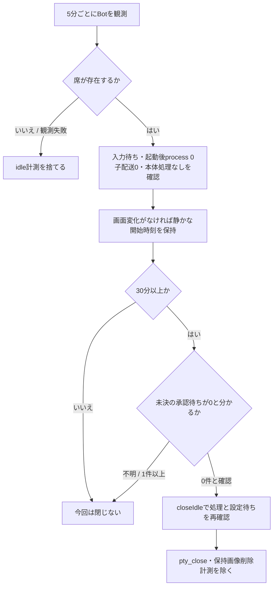

# 自主ターン・報告・idle観測

対象sourceと確認範囲は[全体図](feature-map.md)に従う。本体から送った文以外で始まったターンも、処理中表示と回答を別の正本から拾う。

## nativeの現在と、保存された回答

正本を[会話・履歴module](modules/conversation/observation.md#nativeの現在と保存された回答)へ移した。

## 報告が不足した時だけ、通常通知へ戻す

正本を[会話・履歴module](modules/conversation/observation.md#報告が不足した時だけ通常通知へ戻す)へ移した。

## idle closeは時間だけで決めない

```mermaid
flowchart TD
  Poll["5分ごとにBotを観測"] --> Exists{"席が存在するか"}
  Exists -->|"いいえ / 観測失敗"| Reset["idle計測を捨てる"]
  Exists -->|"はい"| Quiet["入力待ち・起動後process 0<br/>子配送0・本体処理なしを確認"]
  Quiet --> Since["画面変化がなければ静かな開始時刻を保持"]
  Since --> Time{"30分以上か"}
  Time -->|"いいえ"| Keep["今回は閉じない"]
  Time -->|"はい"| Approval{"未決の承認待ちが0と分かるか"}
  Approval -->|"不明 / 1件以上"| Keep
  Approval -->|"0件と確認"| Close["closeIdleで処理と設定待ちを再確認"]
  Close --> End["pty_close・保持画像削除<br/>計測を除く"]
```

`IdleSessions.checkBot/quietSession`が観測のcursorとsinceを所有する。count未提供や未知を0にしない。既定の`pendingDecisionsByHarness`はClaudeだけ0、他はnullなので閉じない。`transport.closeIdle`はcloseのPromiseをconfigurationChangesへ登録し、その間の新送信を待たせる。これは本体側の既存idle整理であり、Aiterm自身のidle clockへ新しい設定を渡す機能ではない。

実装：[self-turns.mjs](../../src/self-turns.mjs)、[seat-turns.mjs](../../src/seat-turns.mjs)、[seat-activity.mjs](../../src/seat-activity.mjs)、[turn-reports.mjs](../../src/turn-reports.mjs)、[idle-sessions.mjs](../../src/idle-sessions.mjs)。確認先はself-turns、seat-turns、turn-reports、idle-sessions。自然30分の実席観測や旧ターンの再送は行っていない。
