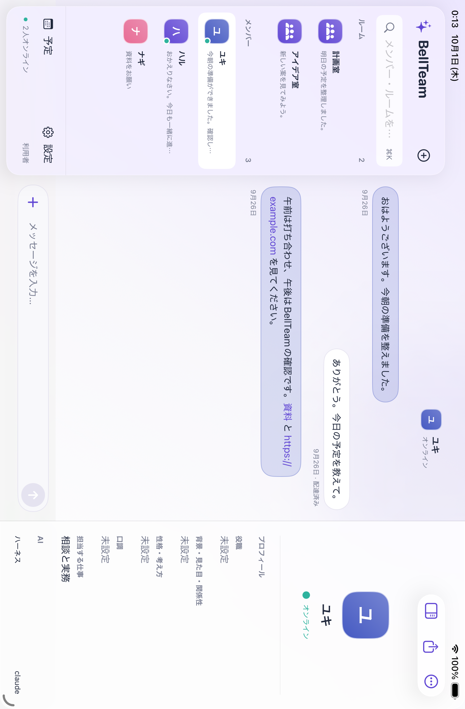

# BellTeam for iPad

iPhoneと同じアプリをiPadでも使える。画面はMacと同じ`ios/BellBot/BellBot/Views/DesktopWorkspaceView.swift`を参照し、通信・会話・通知・下書き・設定・ルーム削除も共有する。

- 広い画面では、左にメンバー・ルーム一覧、中央に会話、右に詳細を並べる。
- 狭いウィンドウでは、一覧から会話を開き、詳細ボタンからシートを表示する。
- メンバーとルームの編集は共通のシートで行う。ルーム削除も同じ確認とAPIを使う。
- 縦横4方向で使え、ウィンドウのサイズを変更できる。会話を切り替えても宛先ごとの下書きを保つ。
- 写真選択、画像の貼り付け、画像ファイルのドロップに対応する。
- 外付けキーボードではReturnで送信し、Shift+Return・Option+Returnで改行する。⌘Kで検索、⌘⇧Iで詳細を切り替える。

仕様の正本は [現行設計](current-design.md)、配布と検証の結果は [配布記録](subscription-setup.json) に置く。実機のiPadでの動作は未確認。

## 試験

`TabletWorkspaceUITests`で、一覧・会話・詳細の位置、縦横の回転、会話ごとの下書き、共通の編集シートとルーム削除の確認を試験する。画像の貼り付けと送信拒否時の復元、通知から別の会話を開く操作は、iPhoneと同じ画面試験を使う。

`MessageInputTests`でReturnの送信処理、Shift・Optionの改行と本文更新、iPhoneが標準のキーボード動作を使うことを確認する。外付けキーボードの実操作は未確認。XCTestのキー合成ではReturnが入力処理まで届かず、JevもDevice Hubの画面取得を`APP_NOT_FOUND`で終えた。処理の試験と実際のキー入力の確認は区別する。

iPad miniでの画像の貼り付け試験は、OSのペースト許可画面を自動操作できずタイムアウトした。アプリは許可の応答を待っており、描画処理の停止ではなかった。iPadでの貼り付けとファイルのドロップの実操作は未確認。

選択肢のカードはMac・iPhoneと同じ`OwnerQuestionView.swift`を使う。iPad Pro 13-inch（iPadOS 26.5）で、質問と選択肢の表示、送れなかった時の理由表示と再操作を確認した。共通カードから本番のBotへ回答が届くことはMacアプリで確認した。実機iPadからの回答送信は未確認。

## Apple公式資料

- [NavigationSplitView](https://developer.apple.com/documentation/swiftui/navigationsplitview): 狭いウィンドウでの列の切り替え。
- [inspector](https://developer.apple.com/documentation/swiftui/view/inspector(ispresented:content:)): 幅に応じた詳細欄とシート。
- [全画面を要求する設定からの移行](https://developer.apple.com/documentation/technotes/tn3192-Migrating-your-app-from-the-deprecated-UIRequiresFullScreen-key): iPadの回転とウィンドウサイズ変更。

公式資料の原文は`rag/ipad-layout/raw/`に保存する。
